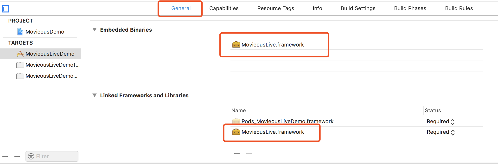

# MovieousLive

MovieousLive 是 [Movieous](https://movieous.cn/) 研发的一站式 RTMP 直播推流 SDK，它提供简单易用的 API，并且拥有超强的机型及版本兼容性，极致的性能表现，丰富的功能以及众多的三方生态支持。集成 MovieousLive 能够让开发者快速构建一款优秀的手机直播 app

## 功能列表

- [x] 音频数据采集
- [x] 音频采集参数配置
- [x] 视频数据采集
- [x] 视频采集参数配置
- [x] H.264 视频编码
- [x] H.264 视频编码参数配置
- [x] H.264 硬件编码
- [x] AAC 音频编码
- [x] AAC 音频编码参数配置
- [x] AAC 硬件编码
- [x] RTMP 协议推流
- [x] 返听
- [x] 内置背景音乐播放器
- [x] 麦克风与背景音乐混音
- [x] 多种音效
- [x] 自定义音频处理
- [x] 静音
- [x] 美颜
- [x] 水印
- [x] 镜像
- [x] 自定义视频处理
- [x] 纯音频或纯视频推流
- [x] 自适应码率
- [x] 动态帧率
- [x] 弱网丢帧优化
- [x] 断线或网络切换自动重连
- [x] 后台推图片 + 音频

## 使用要求

- 系统：版本大于或等于 iOS 8.0
- 机型：性能高于或等于 iPhone 5

## 安装方式

将 `MovieousLive.framework` 拖拽到已使用 Xcode 打开的项目任意目录当中，并确认在相应 target 的 `General` 标签当中 `Embedded Binaries` 以及 `Linked Frameworks and Libraries` 中已添加了 `MovieousLive.framework`



## 快速开始

### 创建音视频配置对象

`MovieousLive` 分别使用 `MLAudioConfiguration` 和 `MLVideoConfiguration` 对象进行音频和视频的参数配置，这两个配置对象都支持使用 `-defaultConfiguration` 方法获取一个默认的配置对象，在获取到默认的配置对象之后我们可以根据业务需求对相关参数进行更改供后续使用。
```
// 创建默认配置对象
MLAudioConfiguration *audioConfiguration = [MLAudioConfiguration defaultConfiguration];
MLVideoConfiguration *videoConfiguration = [MLVideoConfiguration defaultConfiguration];
// 对需要配置的参数进行配置
audioConfiguration.audioBitRate = MLAudioBitRate128Kbps;
videoConfiguration.cameraResolution = AVCaptureSessionPresetHigh;
```
### 创建 `MLController`

使用在上一步创建好的 `MLAudioConfiguration` 和 `MLVideoConfiguration` 对象以及推流服务器的 URL 创建 `MLController` 对象，创建成功之后您可以使用该对象进行直播行为的控制，状态获取和参数调整。

```
MLController controller = [[MLController alloc] initWithURL:[NSURL URLWithString:_URL] audioConfiguration:_audioConfiguration videoConfiguration:_videoConfiguration];
```

- 注意：创建 `MLController` 对象需要保证您已经将推流所使用的域名备案到 [Movieous](https://movieous.cn/) 否则初始化方法将返回 `nil`

### 开始采集

开始进行音视频的采集，当开始采集接口被调用之后系统将会向用户申请摄像头和麦克风的权限（如果在相应配置中 `enable` 被配置为 `YES`）请确保您已经在项目的 `Info.plist` 文件中添加了 `Privacy - Camera Usage Description` 以及 `Privacy - Microphone Usage Description` 的描述，否则调用该接口将会导致程序崩溃。

```
[_movieousLiveController startCapturingWithCompletion:^(AVAuthorizationStatus cameraAuthorizationStatus, AVAuthorizationStatus microphoneAuthorizationStatus, NSError *error) {
    // 做出相应响应
}];
```

### 添加预览视图到当前视图的子视图

`MLController` 提供 `@property(nonatomic, strong, readonly) UIView *preview` 的属性用于预览摄像头采集的数据，您可以将它加入到您当前视图的子视图并调整它的大小以开始预览摄像头的输入。
```
[self.view addSubview:controller.preview];
controller.preview.frame = self.view.bounds;
```
- 注意：请在开始采集之后再获取预览视图，否则获取到的预览视图对象将为 `nil`

### 开始推流

下面可以开始进行推流了

```
[controller startBroadcastingWithCompletion:^(NSError *error) {
    // 做出相应响应
}];
```

### 设置 `MLController` 的 delegate

`MLController` 通过 delegate 的方式进行直播相关状态的通知，您可以通过实现 `MLControllerDelegate` 中定义的方法来获得包括直播状态等相关的通知。

```
{
    ...
    controller.delegate = self
    ...
}

// 获取直播相关状态改变的回调
- (void)controller:(MLController *)controller stateDidChange:(MLState)state error:(NSError *)error {
    // 针对相应直播状态改变做出相应响应
}
```

### 结束推流

当推流完成之后可以调用如下方法结束推流（结束之后依然可以使用该对象再次调用 `-startBroadcastingWithCompletion:` 方法再次开始推流）

```
[controller stopBroadcasting];
```
