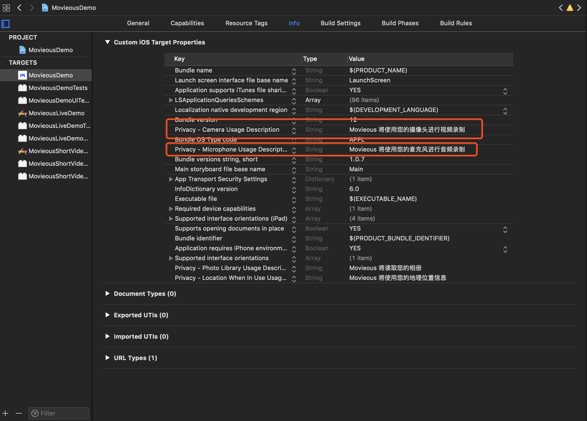

# iOS SDK

##  Release Note

### v1.0.1(2018-12-3)
- 添加 license 验证支持
- 修复频繁切换背景音频等操作可能导致媒体服务被重置后无法正常预览的问题

### v1.0.0(2018-11-28)
- 音/视频采集
- 音/视频编码（H.264 + AAC）
- 实时美颜、滤镜
- 支持第三方美颜、滤镜
- 自定义录制时长、码率、分辨率
- 支持 1:1 录制
- 断点录制
- 回删录制片段
- 抖音特效
- 背景替换
- 手势识别
- 表情识别
- 视频保存为 mp4 格式
- 支持 arm64, x86_64 体系架构

## 如何安装
### Cocoapods 集成

#### 安装 Cocoapods

如果您已安装 Cocoapods，则请直接跳过该步骤，直接进入下一步骤。
如果你未接触过 Cocoapods ，我们推荐您阅读 [唐巧的博客-用CocoaPods做iOS程序的依赖管理](https://blog.devtang.com/2014/05/25/use-cocoapod-to-manage-ios-lib-dependency/ "用CocoaPods做iOS程序的依赖管理") ，了解我们为何使用 Cocoapods 。另外文章中提及的淘宝源已经不再维护，需要使用 [Ruby-China RubyGems 镜像](https://gems.ruby-china.com/)替换。

如果觉得上面两个文章比较繁琐，可以直接根据我们提供的简要步骤，进行安装。
* 简要步骤：打开mac自带的 终端(terminal)，然后输入依次执行下述命令。

```bash
# 注释：Ruby-China 推荐2.6.x，实际 mac  自带的 ruby 也能用了
gem sources --add https://gems.ruby-china.com/ --remove https://rubygems.org/
gem sources -l
# 注释：上面的命令，应该会输出以下内容，>>> 代表此处为输出
>>> https://gems.ruby-china.com
# 注释：确保只有 gems.ruby-china.com

sudo gem install cocoapods
# 注释：由于我们不需要使用官方库，所以可以不执行 pod setup。
```

#### 使用Podfile集成

通过 [CocoaPods](https://cocoapods.org/) 安装可以最大化地简化安装过程。
首先，在项目根目录下的 Podfile 文件中添加以下 pods（我们假设您的项目 target 名称为 `iOSDemo`）：

```ruby
target 'iOSDemo' do
    pod 'MovieousShortVideo'
end
```

<span data-type="color" style="color:rgb(51, 51, 51)"><span data-type="background" style="background-color:rgb(255, 255, 255)">然后在项目根目录执行 </span></span>`pod install`<span data-type="color" style="color:rgb(51, 51, 51)"><span data-type="background" style="background-color:rgb(255, 255, 255)"> </span></span>命令，执行成功后，SDK 就集成到项目中了。
<em>如果长时间没有拉取过pod 仓库，可能出现无法找到我们的repo的情况，此时建议先使用 </em><code><em>pod repo update</em></code><em> 更新pod仓库。</em>

#### SDK 支持情况：

支持 iOS8 及其以上版本。

## 快速开始
Hi, 亲爱的开发者，欢迎使用 Movieous 短视频 SDK。本教程将引导你在自己的 iOS 工程中集成短视频录制，编辑及导出功能。不过首先，我们假定你已经了解 Objective-C 的基础语法。

### 添加依赖
* 首先，你需要参考上一节将 MovieousShortVideo 引入你的工程

### 引入相关头文件
在您需要集成短视频 SDK 的页面源文件中添加如下语句
```objectivec
#import <MovieousShortVideo/MovieousShortVideo.h>
```

下面，你可以根据自己的需求，选择性地集成视频录制、视频编辑或视频导出模块
### 视频录制
- 添加麦克风和摄像头使用权限
打开项目配置页面，Info 选项添加 `Privacy - Camera Usage Description` 和 `Privacy - Microphone Usage Description` 描述


- 生成音频和视频的配置对象并根据需求进行相关参数的更改
```objectivec
    MSVRecorderAudioConfiguration *audioConfiguration = [MSVRecorderAudioConfiguration defaultConfiguration];
    MSVRecorderVideoConfiguration *videoConfiguration = [MSVRecorderVideoConfiguration defaultConfiguration];
    // 根据需求更改需要更改的参数，不更改则使用默认参数
    videoConfiguration.cameraResolution = AVCaptureSessionPreset1280x720;
    videoConfiguration.cameraPosition = AVCaptureDevicePositionFront;
```

- 生成录制核心控制对象
```objectivec
    _recorder = [[MSVRecorder alloc] initWithAudioConfiguration:audioConfiguration videoConfiguration:videoConfiguration error:&error];
    if (error) {
        SHOW_ERROR_ALERT;
        return;
    }
    // 设置最大录制长度
    _recorder.maxDuration = 10;
    // 设置录制事件回调
    _recorder.delegate = self;
    // 将预览视图插入视图栈中，以便预览摄像头采集结果
    _recorder.preview.frame = self.view.frame;
    [self.view insertSubview:_recorder.preview atIndex:0];
```

- 开始音视频采集
```objectivec
    [_recorder startCapturingWithCompletionHandler:^(BOOL audioGranted, NSError *audioError, BOOL videoGranted, NSError *videoError) {
        if (videoError) {
            SHOW_ALERT(@"error", videoError.localizedDescription, @"ok");
            return;
        }
        if (!videoGranted) {
            SHOW_ALERT(@"warning", @"video not authorized", @"ok");
            return;
        }
        dispatch_async(dispatch_get_main_queue(), ^{
            [self syncBeautyParams];
        });
        if (audioError) {
            SHOW_ALERT(@"error", audioError.localizedDescription, @"ok");
            return;
        }
        if (!audioGranted) {
            SHOW_ALERT(@"warning", @"audio not authorized", @"ok");
            return;
        }
    }];
```

- 开始录制片段
```objectivec
    if (![_recorder startRecordingWithClipConfiguration:config error:&error]) {
        SHOW_ERROR_ALERT;
        return;
    }
```

- 完成当前片段录制
```objectivec
    [_recorder finishRecordingWithCompletionHandler:^(MSVMainTrackClip *clip, NSError *error) {
        // 从生成的 clip 对象中可以获取到当前录制片段生成的 mp4 文件及相关描述信息
        if (error) {
            SHOW_ERROR_ALERT;
        }
    }];
```
完成当前片段录制之后还可以回到`开始录制片段`的步骤继续进行下一个片段的录制，所有录制好的片段将会顺序拼接为一个视频草稿保存在 `_recorder.draft` 对象中，可传入编辑器进行编辑或传入导出器直接导出为一个合成后的文件

### 视频编辑
- 创建编辑器核心控制类
```objectivec
    // 此处的 draft 可以使用在录制阶段生成的也可以使用已有音视频资源（例如系统相册或从远端下载等）创建
    _editor = [MSVEditor createSharedInstanceWithDraft:_draft error:&error];
    if (error) {
        SHOW_ERROR_ALERT;
        return;
    }
    _editor.delegate = self;
    // 将预览视图插入视图栈中，以便预览编辑结果
    _previewContainer.preview = _editor.preview;
    _editor.loop = YES;
```

- 预览草稿
```objectivec
    [_editor play];
```

- 进行视频编辑
`MovieousShortVideo` 使用 `MSVDraft` 对象存储视频的编辑信息，你可以根据需求对 `_editor.draft` 的参数进行任意调整，调整之后预览视图会实时刷新为调整参数之后的内容，下面演示一下对视频进行剪辑操作
```objectivec
    _editor.draft.timeRange = (MovieousTimeRange){
        // 需要剪辑的部分的开始时间
        startTime,
        // 需要剪辑的部分的时长
        duration,
    };
```

### 视频导出
- 创建导出核心控制对象
```objectivec
    NSError *error;
    // 创建导出控制对象
    _exporter = [[MSVVideoExporter alloc] initWithDraft:_draft error:&error];
    if (error) {
        SHOW_ERROR_ALERT;
        return;
    }
    // 将导出结果保存到相册中
    _exporter.saveToPhotosAlbum = YES;
    __weak typeof(self) wSelf = self;
    // 进度回调
    _exporter.progressHandler = ^(float progress) {
        NSLog(@"progress: %f", progress);
    };
    // 完成回调
    _exporter.completionHandler = ^(NSURL *URL) {
        SHOW_ALERT_FOR(@"完成", @"成功导出", @"知道啦", wSelf);
    };
    // 失败回调
    _exporter.failureHandler = ^(NSError *error) {
        SHOW_ERROR_ALERT_FOR(wSelf);
    };
```

- 开始导出
```objectivec
    [_exporter startExport];
```

## 主要概念
###草稿(MSVDraft)

草稿是 MovieousShortVideo 的核心数据结构，它代表一个正在制作过程当中的视频项目，它保存了所有的音视频数据源，剪辑，音量调整，特效等等构成最终视频的所有元素，录制阶段的输出、编辑阶段的输入及输出、导出阶段的输入均为草稿对象，开发者所有的视频编辑操作都通过草稿对象来完成。

### 主轨片段(MSVMainTrackClip)

主轨片段是构成草稿的基本要素，草稿的主音视频由主轨片段的音视频顺序拼接产生，草稿的时长为所有主轨片段的时长总和。

### 音效片段(MSVAudioClip)

音效片段是在主轨音频的基础上增加的背景音频，它按照指定的音量和主轨及其他有重合部分的音频进行混合形成目的视频的音频。

### 特效

特效是在草稿的主轨的基础之上叠加的包括滤镜，反复，变速等在内多种效果。

### 录制器(MSVRecorder)

录制器主要提供视频分段录制功能，产生多个视频片段构成主轨，添加的背景音乐作为草稿的音效片段。

### 编辑器(MSVEditor)

编辑器提供对草稿的实时预览功能，能够实时预览草稿编辑的效果。

### 导出器(MSVVideoExporter)

导出器接受草稿对象作为输入，导出为各种格式的目标文件

## 使用指南
### 草稿对象
```objectivec
/**
 * @brief 视频草稿，调用者可以自行生成草稿或直接草稿进行任意编辑，然后使用 MSVEditor 实时生成草稿的预览，也可以使用 MSVExporter 对草稿进行导出
 */
@interface MSVDraft : NSObject

/**
 * @brief 主轨道片段集合，主轨道片段按照其 durationAtMainTrack 所指定的时长顺序排列组成视频的主轨道，草稿的长度由主轨道时长决定
 */
@property (nonatomic, strong, readonly) NSArray<MSVMainTrackClip *> *mainTrackClips;

/**
 * @brief 音频片段集合，草稿的音频为由 mainTrackClips 中的音频与 audioClips 按照各自的音量进行混合产生
 */
@property (nonatomic, strong, readonly) NSArray<MSVAudioClip *> *audioClips;

/**
 * @brief 特效集合，当前支持 MSVExternalFilterEffect、MSVLUTFilterEffect、MSVImageEffect、MSVRepeatEffect、MSVSpeedEffect，这些效果均只应用到主轨上
 */
@property (nonatomic, strong, readonly) NSArray *effects;

/**
 * @brief 草稿原始总时长（不考虑时间特效，不考虑 timeRange）
 */
@property (nonatomic, assign, readonly) NSTimeInterval originalDuration;

/**
 * @brief 草稿总时长（考虑时间特效，不考虑 timeRange）
 */
@property (nonatomic, assign, readonly) NSTimeInterval duration;

/**
 * @brief 视频的大小，预览时如果窗口的大小与 videoSize 的大小不一致，将按照 editor.previewScalingMode 指定的缩放方式进行缩放
 */
@property (nonatomic, assign) CGSize videoSize;

/**
 * @brief 有效的时间区域，其他部分将被忽略
 * @warning 这里的时间区间是以应用完时间特效之后的区间，调用者如果设置了 timeRange，对主轨进行相关增删改或更新时间特效之后要配合调整 timeRange，以保证应用正确的 timeRange
 */
@property (nonatomic, assign) MovieousTimeRange timeRange;

/**
 * @brief 使用音视频文件地址来初始化一份草稿，初始化后的草稿将包含一个 MSVMainTrackClip 指向该文件的地址
 * @param URL 音视频文件的地址
 * @param outError 如果发生错误，返回发生的错误
 * @return 初始化成功的草稿对象
 */
+ (instancetype)draftWithAVURL:(NSURL *)URL error:(NSError **)outError;

/**
 * @brief 使用图片文件地址来创建一个草稿对象，初始化后的草稿将包含一个 MSVMainTrackClip 指向该文件的地址
 * @param URL 图片文件的地址
 * @param outError 如果发生错误，返回发生的错误
 * @return 创建成功则返回草稿对象，失败返回 nil
 */
+ (instancetype)draftWithImageURL:(NSURL *)URL error:(NSError **)outError;

/**
 * @brief 初始化草稿对象
 * @param mainTrackClipType 主轨道片段类型
 * @param URL 主轨道片段的地址
 * @param outError 如果发生错误，返回发生的错误
 * @return 初始化成功则返回草稿对象，失败返回 nil
 */
- (instancetype)initWithMainTrackClipType:(MSVMainTrackClipType)mainTrackClipType URL:(NSURL *)URL error:(NSError **)outError;

/**
 * @brief 生成草稿的预览截屏
 * @param count 预览截屏的数量
 * @param withinTimeRange 是否只生成 timeRange 范围内的截图
 * @param handler 完成后的回调，timestamp：截屏时间戳，snapshot：截屏，error：如发生错误即所发生的错误
 */
- (void)generateSnapshotsWithCount:(NSUInteger)count withinTimeRange:(BOOL)withinTimeRange completionHanler:(void (^)(NSTimeInterval timestamp, UIImage *snapshot, NSError *error))handler;

/**
 * @brief 更新主轨片段集，非 readonly 的参数可以直接在相关对象中调整，其他操作（增、删、替换等）需要使用该接口进行刷新
 * @param mainTrackClips 新的主轨片段集
 * @param outError 如果发生错误，返回发生的错误
 * @return 有效返回 YES，无效返回 NO
 */
- (BOOL)updateMainTrackClips:(NSArray<MSVMainTrackClip *> *)mainTrackClips error:(NSError **)outError;

/**
 * @brief 更新音频片段集，非 readonly 的参数可以直接在相关对象中调整，其他操作（增、删、替换等）需要使用该接口进行刷新
 * @param audioClips 新的音频片段集合
 * @param outError 如果发生错误，返回发生的错误
 * @return 有效返回 YES，无效返回 NO
 */
- (BOOL)updateAudioClips:(NSArray<MSVAudioClip *> *)audioClips error:(NSError **)outError;

/**
 * @brief 更新特效集合
 * @param effects 新的特效集合
 * @param outError 如果发生错误，返回发生的错误
 * @return 有效返回 YES，无效返回 NO
 */
- (BOOL)updateEffects:(NSArray *)effects error:(NSError **)outError;

/**
 * @brief 验证当前草稿是否能够有效
 * @param outError 如果发生错误，返回发生的错误
 * @return 有效返回 YES，无效返回 NO
 */
- (BOOL)validateForRecorderWithError:(NSError **)outError;

/**
 * @brief 验证草稿是否有效
 * @param outError 如果发生错误，返回发生的错误
 * @return 有效返回 YES，无效返回 NO
 */
- (BOOL)validateForWithError:(NSError **)outError;

/**
 * @brief 更新音量的操作是实时进行了，当你需要批量修改很多片段的音量时为了提高操作的效率请先调用该方法，然后进行相关音量修改，最后调用 -commitVolumeChange 方法提交修改。如果不按照这种范式进行调用那每次修改音量都会触发更新操作，这将会导致
 */
- (void)beginVolumeChangeTransaction;

/**
 * @brief 提交音量更新
 */
- (BOOL)commitVolumeChangeWithError:(NSError **)outError;

/**
 * @brief 除了更新音量以外的其他操作，当你需要批量对相关属性进行操作时可以调用该方法开始一个 transaction，然后再完成所有操作之后再调用 -commitChangeWithError: 方法提交所有修改
 */
- (void)beginChangeTransaction;

/**
 * @brief 取消当前批量更新 transaction
 */
- (void)cancelChangeTransaction;

/**
 * @brief 提交一般属性的更新
 */
- (BOOL)commitChangeWithError:(NSError **)outError;

/**
 * @brief 工具方法，对原始时间点应用时间特效，映射为应用时间特效后的时间点
 * @param time 未应用时间特效的时间点
 * @return 应用时间特效后的时间点
 */
- (NSTimeInterval)applyEffectToTime:(NSTimeInterval)time;

/**
 * @brief 工具方法，将已应用时间特效的时间点映射到去掉时间特效的时间点
 * @param time 已应用时间特效的时间点
 * @return 去掉时间特效后的时间点
 */
- (NSTimeInterval)removeEffectFromTime:(NSTimeInterval)time;

/**
 * @brief 工具方法，对原始时间区间应用时间特效，映射为应用时间特效后的时间区间
 * @param timeRange 未应用时间特效的时间区间
 * @return 应用时间特效后的时间区间
 */
- (MovieousTimeRange)applyEffectToTimeRange:(MovieousTimeRange)timeRange;

/**
 * @brief 工具方法，将已应用时间特效的时间区间映射到去掉时间特效的时间区间
 * @param timeRange 已应用时间特效的时间区间
 * @return 去掉时间特效后的时间区间
 */
- (MovieousTimeRange)removeEffectFromTimeRange:(MovieousTimeRange)timeRange;

@end
```

### 主轨片段
```objectivec
/**
 * @brief 主轨片段的类型
 */
typedef NS_ENUM(NSInteger, MSVMainTrackClipType) {
    /**
     * 音视频媒体资源类型
     */
    MSVMainTrackClipTypeAV,
    /**
     * 图片资源类型
     */
    MSVMainTrackClipTypeImage
};

/**
 * @brief 主轨片段
 */
@interface MSVMainTrackClip : NSObject <NSCopying>

/**
 * @brief 用户自定义 ID 字段，业务使用用于区分对象
 */
@property (nonatomic, strong) NSString *ID;

/**
 * @brief 主轨媒体的类型
 */
@property (nonatomic, assign, readonly) MSVMainTrackClipType type;

/**
 * @brief 媒体文件的地址
 */
@property (nonatomic, strong, readonly) NSURL *URL;

/**
 * @brief 上片段结束，本片段开始衔接的转场时间
 * @warning 需要注意的是每个片段的首尾转场效果时长总和不能超过该片段的有效时长，例如存在转场 A：1->2，时长为2秒，转场 B：2->3，时长为3秒，则片段2的时长应当大于5秒，否则将会出现错误
 */
@property (nonatomic, assign) NSTimeInterval transitionDuration;

/**
 * @brief 上片段结束，本片段开始衔接的转场效果的类型，默认为 MSVVideoTransitionTypeDissolve
 */
@property (nonatomic, assign) MSVVideoTransitionType videoTransitionType;

// 以下参数仅对 MSVMainTrackClipTypeAV 类型的主轨片段生效
#pragma mark - video properties
/**
 * @brief 音视频媒体文件生成的 AVAsset 对象，可以在这里获取一些需要的参数
 */
@property (nonatomic, strong, readonly) AVAsset *asset;

/**
 * @brief 在媒体片段当中截取使用的时间范围
 * @warning 这个时间范围是指没有经过快慢速处理及倒放处理之前的时间范围，另外，如果 timeRange.startTime + timeRange.duration > 媒体总时长将忽略超出的部分
 */
@property (nonatomic, assign) MovieousTimeRange timeRange;

/**
 * @brief 音频片段的速度
 * 一般来说可以进行如下配置：
 * 极快：2.0
 * 快：1.5
 * 正常：1.0
 * 慢：0.75
 * 极慢：0.5
 */
@property (nonatomic, assign) float speed;

/**
 * @brief 媒体音频的音量，默认为媒体文件中自带的 preferredVolume
 */
@property (nonatomic, assign) float volume;


- (void)setReverse:(BOOL)reverse progressHandler:(void(^)(float progress))progressHandler completionHandler:(void(^)(NSError *error))completionHandler;

- (void)cancelReverse;

/**
 * @brief 是否倒放该段视频
 */
@property (nonatomic, assign, readonly) BOOL reverse;

// 以下参数仅对 MSVMainTrackClipTypeAV 类型的主轨片段生效
#pragma mark - image properties
/**
 * @brief 图片对象
 */
@property (nonatomic, assign, readonly) UIImage *image;

/**
 * @brief 主轨片段在主轨当中的时长，此参数和 speed 互相影响，具体的运算关系为 speed = timeRange.duration / durationAtMainTrack
 */
@property (nonatomic, assign) NSTimeInterval durationAtMainTrack;

/**
 * @brief 创建一个主轨片段
 * @param type 主轨片段的类型
 * @param URL 主轨片段的文件路径，只支持本地文件
 * @param outError 如果发生错误，返回发生的错误
 * @return 创建成功返回创建完成的对象，失败返回 nil
 */
+ (instancetype)mainTrackClipWithType:(MSVMainTrackClipType)type URL:(NSURL *)URL error:(NSError **)outError;

/**
 * @brief 使用 AVAsset 创建一个音视频类型的主轨片段
 * @param asset 用于创建主轨片段的 AVAsset 对象
 * @param outError 如果发生错误，返回发生的错误
 * @return 创建成功返回创建完成的对象，失败返回 nil
 */
+ (instancetype)mainTrackClipWithAsset:(AVAsset *)asset error:(NSError **)outError;

/**
 * @brief 使用 UIImage 创建一个图片类型的主轨片段
 * @param image 用于创建主轨片段的 UIImage 对象
 * @param outError 如果发生错误，返回发生的错误
 * @return 创建成功返回创建完成的对象，失败返回 nil
 */
+ (instancetype)mainTrackClipWithImage:(UIImage *)image duration:(NSTimeInterval)duration error:(NSError **)outError;

/**
 * @brief 初始化一个主轨片段
 * @param type 主轨片段的类型
 * @param URL 主轨片段的文件路径，只支持本地文件
 * @param outError 如果发生错误，返回发生的错误
 * @return 初始化成功返回初始化完成的对象，失败返回 nil
 */
- (instancetype)initWithType:(MSVMainTrackClipType)type URL:(NSURL *)URL error:(NSError **)outError;

/**
 * @brief 使用 AVAsset 初始化一个音视频类型的主轨片段
 * @param asset 用于创建主轨片段的 AVAsset 对象
 * @param outError 如果发生错误，返回发生的错误
 * @return 初始化成功返回创建完成的对象，失败返回 nil
 */
- (instancetype)initWithAsset:(AVAsset *)asset error:(NSError **)outError;

/**
 * @brief 使用 UIImage 初始化一个图片类型的主轨片段
 * @param image 用于创建主轨片段的 UIImage 对象
 * @param duration 图片时长
 * @param outError 如果发生错误，返回发生的错误
 * @return 初始化成功返回创建完成的对象，失败返回 nil
 */
- (instancetype)initWithImage:(UIImage *)image duration:(NSTimeInterval)duration error:(NSError **)outError;

/**
 * @brief 验证改主轨片段是否有效
 * @param outError 如果发生错误，返回发生的错误
 * @return 有效返回 YES，无效返回 NO
 */
- (BOOL)validateWithError:(NSError **)outError;

@end
```

### 音效片段
```objectivec
/**
 * @brief 音频片段
 */
@interface MSVAudioClip<MSVClip> : NSObject

/**
 * @brief 用户自定义 ID 字段，业务使用用于区分对象
 */
@property (nonatomic, strong) NSString *ID;

/**
 * @brief 音频片段的 URL，只支持本地文件
 */
@property (nonatomic, strong, readonly) NSURL *URL;

/**
 * @brief 底层使用的 AVAsset 对象，可以获取 duration 等媒体参数
 */
@property (nonatomic, strong, readonly) AVAsset *asset;

/**
 * @brief 音频片段在主轨中开始的时间，音频片段在主轨中实际的时长为 timeRange.duration / speed
 */
@property (nonatomic, assign) NSTimeInterval startTimeAtMainTrack;

/**
 * @brief 在音频片段当中截取使用的时间范围，这个时间范围是指没有经过快慢速处理之前的时间范围，请注意，timeRange.startTime + timeRange.duration <= 媒体总时长
 */
@property (nonatomic, assign) MovieousTimeRange timeRange;

/**
 * @brief 音频片段的速度，此参数和 timeRangeAtMainTrack.duration 互相影响，具体的运算关系为 speed = timeRange.duration / timeRangeAtMainTrack.duration
 * 一般来说可以进行如下配置：
 * 极快：2.0
 * 快：1.5
 * 正常：1.0
 * 慢：0.75
 * 极慢：0.5
 */
@property (nonatomic, assign) float speed;

/**
 * @brief 音频片段的音量，默认为媒体自带的
 */
@property (nonatomic, assign) float volume;

/**
 * @brief 使用媒体地址来创建音频片段
 * @param URL 音频片段的地址，只支持本地文件
 * @param outError 如果发生错误，返回发生的错误
 * @return 创建成功返回初始化后的对象，否则返回 nil
 */
+ (instancetype)audioClipWithURL:(NSURL *)URL error:(NSError **)outError;

/**
 * @brief 使用媒体地址来初始化音频片段
 * @param URL 音频片段的地址，只支持本地文件
 * @param outError 如果发生错误，返回发生的错误
 * @return 初始化成功返回初始化后的对象，否则返回 nil
 */
- (instancetype)initWithURL:(NSURL *)URL error:(NSError **)outError NS_DESIGNATED_INITIALIZER;

/**
 * @brief 验证草稿是否有效
 * @param outError 如果发生错误，返回发生的错误
 * @return 有效返回 YES，无效返回 NO
 */
- (BOOL)validateWithError:(NSError **)outError;

@end
```

### 速度特效
```objectivec
/**
 * @brief 速度特效
 */
@interface MSVSpeedEffect : NSObject

/**
 * @brief 用户自定义 ID 字段，业务使用用于区分对象
 */
@property (nonatomic, strong) NSString *ID;

/**
 * @brief 在主轨当中需要应用速度效果的时间区间，这个时间区间是指未应用速度效果前的时间区间
 * @warning 需要注意的是如果插入多个跟时间有关的特效时（MSVRepeatEffect 及 MSVSpeedEffect），后插入的时间特效中 timeRangeAtMainTrack 应当以之前所有特效应用之后的时间轴为标准
 */
@property (nonatomic, assign) MovieousTimeRange timeRangeAtMainTrack;

/**
 * @brief 速度，添加速度特效后在相应特效时间区间内的实际速度将变为区间内各 MSVMainTrackClip 对象的 speed 乘以特效 speed
 */
@property (nonatomic, assign) float speed;

@end
```

### 反复特效
```objectivec
/**
 * @brief 反复特效
 */
@interface MSVRepeatEffect : NSObject

/**
 * @brief 用户自定义 ID 字段，业务使用用于区分对象
 */
@property (nonatomic, strong) NSString *ID;

/**
 * @brief 在主轨当中应用反复效果的时间区间
 * @warning 需要注意的是如果插入多个跟时间有关的特效时（MSVRepeatEffect 及 MSVSpeedEffect），后插入的时间特效中 timeRangeAtMainTrack 应当以之前所有特效应用之后的时间轴为标准
 */
@property (nonatomic, assign) MovieousTimeRange timeRangeAtMainTrack;

/**
 * @brief 反复次数
 */
@property (nonatomic, assign) NSUInteger count;

@end
```

### 图片贴纸特效
```objectivec
/**
 * @brief 图片贴纸效果
 */
@interface MSVImagePasterEffect : NSObject

/**
 * @brief 用户自定义 ID 字段，业务使用用于区分对象
 */
@property (nonatomic, strong) NSString *ID;

/**
 * @brief 图片贴纸所使用的图片
 */
@property (nonatomic, strong, readonly) UIImage *image;

/**
 * @brief 贴纸的目标位置和大小
 * @warning 长宽比例和贴纸本身的长宽比不一致时贴纸会发生变形
 */
@property (nonatomic, assign) CGRect destRect;

/**
 * @brief 在主轨当中应用外部滤镜的时间区间
 */
@property (nonatomic, assign) MovieousTimeRange timeRangeAtMainTrack;

- (instancetype)initWithImage:(UIImage *)image;

+ (instancetype)pasterEffectWithImage:(UIImage *)image;

@end
```

### 颜色查找表滤镜特效
```objectivec
/**
 * @brief 颜色查找表滤镜特效
 */
@interface MSVLUTFilterEffect : NSObject

/**
 * @brief 用户自定义 ID 字段，业务使用用于区分对象
 */
@property (nonatomic, strong) NSString *ID;

/**
 * @brief LUT(look up table) 滤镜的图片文件地址，只支持本地文件
 */
@property (nonatomic, strong, readonly) NSURL *URL;

/**
 * @brief 在主轨当中应用颜色查找表滤镜特效的时间区间
 */
@property (nonatomic, assign) MovieousTimeRange timeRangeAtMainTrack;

@end
```

### 外部滤镜特效
```objectivec
/**
 * @brief 外部滤镜效果协议，所有外部滤镜都需要遵守此协议
 */
@protocol MSVExternalFilter <NSObject>

@required
/**
 * @brief 生成一个共享的外部滤镜对象
 * @return 生成的外部滤镜对象
 */
+ (instancetype)sharedInstance;
@optional

/**
 * @brief 处理视频数据
 * @param pixelBuffer 待处理的视频数据
 * @param sampleTimingInfo 待处理视频数据的时间戳
 * @return 处理完成的视频数据，可以直接返回待处理的视频数据，即不进行任何处理
 */
- (CVPixelBufferRef)processPixelBuffer:(CVPixelBufferRef)pixelBuffer sampleTimingInfo:(CMSampleTimingInfo)sampleTimingInfo;

@end
@interface MSVExternalFilterEffect : NSObject

/**
 * @brief 用户自定义 ID 字段，业务使用用于区分对象
 */
@property (nonatomic, strong) NSString *ID;

/**
 * @brief 外部滤镜的 class
 */
@property (nonatomic, assign) Class<MSVExternalFilter> externalFilterClass;

/**
 * @brief 在主轨当中应用外部滤镜的时间区间
 */
@property (nonatomic, assign) MovieousTimeRange timeRangeAtMainTrack;

@end
```

### 录制器
```objectivec
@class MSVRecorder;

/**
 * @brief 录制器代理接口
 */
@protocol MSVRecorderDelegate <NSObject>

@optional
/**
 * @brief 当用户点击预览界面对焦时回调
 * @param recorder 产生事件的录制器对象
 * @param point 用户点击的位置
 */
- (void)recorder:(MSVRecorder *)recorder didFocusAtPoint:(CGPoint)point;

/**
 * @brief 录制器到达配置的最大时长
 * @param recorder 产生事件的录制器对象
 */
- (void)recorderDidReachMaxDuration:(MSVRecorder *)recorder;

/**
 * @brief 录制器播放背景音乐时发生错误
 * @param recorder 产生事件的录制器对象
 * @param error 产生的具体错误
 */
- (void)recorder:(MSVRecorder *)recorder didPlayBackgroundAudioError:(NSError *)error;

/**
 * @brief 当前录制片段的时长发生更新的回调，调用者可以在此回调当中更新 UI 反馈录制进度
 * @param recorder 产生事件的录制器对象
 * @param currentClipDuration 当前片段的时长
 */
- (void)recorder:(MSVRecorder *)recorder currentClipDurationDidUpdated:(NSTimeInterval)currentClipDuration;

/**
 * @brief 摄像头获取到视频数据的回调，调用者可以实现该方法来对视频数据进行自定义处理，处理后的数据将会反馈在预览图像并编码到生成的片段当中
 * @param recorder 产生事件的录制器对象
 * @param pixelBuffer 待处理的视频数据
 * @return 处理完成的视频数据
 */
- (CVPixelBufferRef)recorder:(MSVRecorder *)recorder didGetPixelBuffer:(CVPixelBufferRef)pixelBuffer;

@end

/**
 * @brief 录制器
 */
@interface MSVRecorder : NSObject

/**
 * @brief Recorder 自动生成的草稿对象，可以通过此属性获取草稿对象用于编辑或导出
 */
@property (nonatomic, strong, readonly) MSVDraft *draft;

/**
 * @brief 视频参数配置对象
 * @warning 请不要修改获取到的 videoConfiguration 对象，否则会出现未定义的错误，更新参数请使用相关运行时属性更新接口或销毁当前 Recorder 重新生成
 */
@property (nonatomic, strong, readonly) MSVRecorderVideoConfiguration *videoConfiguration;

/**
 * @brief 音频参数配置对象
 * @warning 请不要修改获取到的 videoConfiguration 对象，否则会出现未定义的错误，更新参数请使用相关运行时属性更新接口或销毁当前 Recorder 重新生成
 */
@property (nonatomic, strong, readonly) MSVRecorderAudioConfiguration *audioConfiguration;

/**
 * @brief 当前片段已经录制的时间长度
 */
@property (nonatomic, assign, readonly) NSTimeInterval currentClipDuration;

/**
 * @brief 所有已经保存的片段的时间长度
 */
@property (nonatomic, assign, readonly) NSTimeInterval recordedClipsDuration;

/**
 * @brief 最大的录制长度，这里的录制长度指的是所有片段长度的总和，当录制长度到达最大值时，delegate 的 `recorderDidReachMaxDuration` 方法将被调用，如果该值小于或等于 0 则表示没有最大长度限制
 */
@property (nonatomic, assign) NSTimeInterval maxDuration;

/**
 * @brief 预览视图
 */
@property (nonatomic, strong, readonly) UIView *preview;

/**
 * @brief 代理对象，用于接收事件回调
 */
@property (nonatomic, weak) id<MSVRecorderDelegate> delegate;

/**
 * @brief 代理方法回调使用的队列，如果未指定将在主线程回调
 */
@property (nonatomic, strong) dispatch_queue_t delegateQueue;

/**
 * @brief 当预览视窗与配置的 videoSize 比例不一致时使用的填充模式，默认为 MovieousScalingModeAspectFit
 */
@property (nonatomic, assign) MovieousScalingMode previewScalingMode;

/**
 * @brief 当前是否处于正在录制的状态
 */
@property (nonatomic, assign) BOOL recording;

/**
 * @brief 是否对前置摄像头预览进行镜像处理，默认为 YES
 */
@property (nonatomic, assign) BOOL mirrorFrontPreview;

/**
 * @brief 是否对后置摄像头预览进行镜像处理，默认为 NO
 */
@property (nonatomic, assign) BOOL mirrorBackPreview;

/**
 * @brief 是否对前置摄像头编码的视频进行镜像处理，默认为 NO
 */
@property (nonatomic, assign) BOOL mirrorFrontEncoded;

/**
 * @brief 是否对后置摄像头编码的视频进行镜像处理，默认为 NO
 */
@property (nonatomic, assign) BOOL mirrorBackEncoded;

/**
 * @brief 是否开启内部的聚焦视图，默认为 NO
 */
@property (nonatomic, assign) BOOL innerFocusView;

/**
 * @brief 获取截图
 */
@property (nonatomic, strong, readonly) UIImage *snapshot;

/**
 * @brief 录制进入后台时自动采取的操作，如果不自动进行操作那调用方需要自行进行适当的处理（完成或取消当前片段的录制），默认为 MSVBackgroundActionContinue
 */
@property (nonatomic, assign) MSVBackgroundAction backgroundAction;

/**
 * @brief 是否开启了手电筒，默认为 NO
 */
@property (nonatomic, assign, readonly) BOOL torchOn;

/**
 * @brief 开关手电筒接口
 * @param torchOn 开启或关闭
 * @param outError 如果发生错误，返回发生的错误
 * @return 设置成功返回 YES，否则返回 NO
 */
- (BOOL)setTorchOn:(BOOL)torchOn error:(NSError **)outError;

/**
 * @brief 采集视频的帧率
 */
@property (nonatomic, assign, readonly) NSUInteger frameRate;

/**
 * @brief 设置采集视频的帧率
 * @param frameRate 新的帧率
 * @param outError 如果发生错误，返回发生的错误
 * @return 设置成功返回 YES，否则返回 NO
 */
- (BOOL)setFrameRate:(NSUInteger)frameRate error:(NSError **)outError;

/**
 * @brief 相机采集的分辨率，默认为 AVCaptureSessionPresetHigh
 */
@property (nonatomic, strong, readonly) AVCaptureSessionPreset cameraResolution;

/**
 * @brief 设置相机采集的分辨率
 * @param cameraResolution 新的分辨率
 * @param outError 如果发生错误，返回发生的错误
 * @return 设置成功返回 YES，否则返回 NO
 */
- (BOOL)setCameraResolution:(AVCaptureSessionPreset)cameraResolution error:(NSError **)outError;

/**
 * @brief 摄像头的位置，默认为 AVCaptureDevicePositionBack
 */
@property (nonatomic, assign, readonly) AVCaptureDevicePosition cameraPosition;

/**
 * @brief 设置摄像头的位置
 * @param cameraPosition 新的摄像头位置
 * @param outError 如果发生错误，返回发生的错误
 * @return 设置成功返回 YES，否则返回 NO
 */
- (BOOL)setCameraPosition:(AVCaptureDevicePosition)cameraPosition error:(NSError **)outError;

/**
 * @brief 摄像头的旋转方向，默认为 AVCaptureVideoOrientationPortrait
 */
@property (nonatomic, assign, readonly) AVCaptureVideoOrientation cameraOrientation;

/**
 * @brief 设置摄像头的旋转方向
 * @param cameraOrientation 新的摄像头旋转方向
 * @param outError 如果发生错误，返回发生的错误
 * @return 设置成功返回 YES，否则返回 NO
 */
- (BOOL)setCameraOrientation:(AVCaptureVideoOrientation)cameraOrientation error:(NSError **)outError;

/**
 * @brief 摄像头变焦系数，默认为 1
 */
@property (nonatomic, assign, readonly) CGFloat cameraZoomFactor;

/**
 * @brief 设置摄像头变焦系数
 * @param cameraZoomFactor 新的摄像头变焦系数
 * @param outError 如果发生错误，返回发生的错误
 * @return 设置成功返回 YES，否则返回 NO
 */
- (BOOL)setCameraZoomFactor:(CGFloat)cameraZoomFactor error:(NSError **)outError;

/**
 * @brief 对焦和曝光参考点（点的位置以 cameraResolution 指定的采集分辨率为参考系，左上角为原点，朝右和朝下分别为 x 值和 y 值递增的方向）
 */
@property (nonatomic, assign, readonly) CGPoint pointOfInterest;

/**
 * @brief 设置对焦和曝光的参考点
 * @param pointOfInterest 新的对焦曝光参考点
 * @param outError 如果发生错误，返回发生的错误
 * @return 设置成功返回 YES，否则返回 NO
 */
- (BOOL)setPointOfInterest:(CGPoint)pointOfInterest error:(NSError **)outError;

/**
 * @brief 初始化一个空的录制器
 * @param audioConfiguration 音频配置，传入 nil 将使用默认配置
 * @param videoConfiguration 视频配置，传入 nil 将使用默认配置
 * @param outError 如果发生错误，返回发生的错误
 * @return 初始化成功返回初始化后的对象，否则返回 nil
 */
- (instancetype)initWithAudioConfiguration:(MSVRecorderAudioConfiguration *)audioConfiguration videoConfiguration:(MSVRecorderVideoConfiguration *)videoConfiguration error:(NSError **)outError;

/**
 * @brief 使用保存的草稿初始化一个录制器，使用此方法创建的录制器后续所有录制的片段和背景音乐都将添加到初始化使用的草稿对象中
 * @param draft 初始化使用的草稿对象
 * @param audioConfiguration 音频配置，传入 nil 将使用默认配置
 * @param videoConfiguration 视频配置，传入 nil 将使用默认配置
 * @param outError 如果发生错误，返回发生的错误
 * @return 初始化成功返回初始化后的对象，否则返回 nil
 */
- (instancetype)initWithDraft:(MSVDraft *)draft AudioConfiguration:(MSVRecorderAudioConfiguration *)audioConfiguration videoConfiguration:(MSVRecorderVideoConfiguration *)videoConfiguration error:(NSError **)outError;

/**
 * @brief 开始采集音视频，调用此方法将请求音视频的使用权限（如果指定音视频数据源为摄像头或麦克风的话）
 * @param completionHandler 调用完成的回调，audioGranted：是否获得音频权限，audioError：音频组件初始化发生的错误，videoGranted：是否获得了视频的采集权限，videoError：视频组件初始化发生的错误
 */
- (void)startCapturingWithCompletionHandler:(void(^)(BOOL audioGranted, NSError *audioError, BOOL videoGranted, NSError *videoError))completionHandler;

/**
 * @brief 开始采集音视频，调用此方法将请求音视频的使用权限（如果指定音视频数据源为摄像头或麦克风的话）
 * @param compromise 是否允许妥协部分不受当前设备支持的参数以保证尽最大努力使组件初始化成功
 * @param completionHandler 调用完成的回调，audioGranted：是否获得音频权限，audioError：音频组件初始化发生的错误，videoGranted：是否获得了视频的采集权限，videoError：视频组件初始化发生的错误
 */
- (void)startCapturingWithCompromise:(BOOL)compromise completionHandler:(void(^)(BOOL audioGranted, NSError *audioError, BOOL videoGranted, NSError *videoError))completionHandler;

/**
 * @brief 停止采集
 */
- (void)stopCapturing;

/**
 * @brief 使用默认配置开始录制
 * @param outError 如果发生错误，返回发生的错误
 * @return 设置成功返回 YES，否则返回 NO
 */
- (BOOL)startRecordingWithError:(NSError **)outError;

/**
 * @brief 使用指定配置开始录制
 * @param clipConfiguration 录制使用的配置，传入 nil 将使用默认配置
 * @param outError 如果发生错误，返回发生的错误
 * @return 设置成功返回 YES，否则返回 NO
 */
- (BOOL)startRecordingWithClipConfiguration:(MSVClipConfiguration *)clipConfiguration error:(NSError **)outError;

/**
 * @brief 完成录制
 * @param completionHandler 停止成功的回调，clip：录制产生的主轨道片段对象，error：发生的错误
 */
- (void)finishRecordingWithCompletionHandler:(void(^)(MSVMainTrackClip *clip, NSError *error))completionHandler;

/**
 * @brief 删除上一段录制的片段
 */
- (void)discardLastClip;

/**
 * @brief 删除指定索引的片段
 * @param index 需要删除的片段的索引
 */
- (void)discardClipAtIndex:(NSUInteger)index;

/**
 * @brief 删除所有录制的片段
 */
- (void)discardAllClips;

/**
 * @brief 切换摄像头
 * @param outError 如果发生错误，返回发生的错误
 * @return 设置成功返回 YES，否则返回 NO
 */
- (BOOL)switchCameraWithError:(NSError **)outError;

/**
 * @brief 设置水印
 * @param waterMark 水印使用的图片
 * @param position 水印的位置
 */
- (void)setWaterMark:(UIImage *)waterMark position:(CGPoint)position;

/**
 * @brief 清除水印
 */
- (void)clearWaterMark;

/**
 * @brief 开启设备朝向自动检测
 * @param orientationUpdatedBlock 设备旋转方向改变时的回调
 */
- (void)enableAutoOrientationAdaptionWithOrientationUpdatedBlock:(void(^)(UIDeviceOrientation))orientationUpdatedBlock;

/**
 * @brief 关闭设备朝向自动检测
 */
- (void)disableAutoOrientationAdaption;

/**
 * @brief 更新录制器使用的草稿对象
 * @param draft 新的草稿对象
 * @param outError 如果发生错误，返回发生的错误
 * @return 设置成功返回 YES，否则返回 NO
 */
- (BOOL)updateDraft:(MSVDraft *)draft error:(NSError **)outError;

/**
 * @brief 背景音效配置对象
 */
@property(nonatomic, strong, readonly) MSVBackgroundAudioConfiguration *backgroundAudioConfiguration;

/**
 * @brief 只有在未开始录制或者已经删除所有已录制的片段之后才能设置或取消背景音乐，设置的背景音乐信息会体现在 draft.audioClips 中而不会直接编码到生成的录制文件当中，以便在编辑阶段可以随时替换背景音乐
 * @param configuration 背景音效配置对象，传入 nil 清空背景音效
 * @param outError 如果发生错误，返回发生的错误
 * @return 设置成功返回 YES，否则返回 NO
 */
- (BOOL)setBackgroundAudioWithConfiguration:(MSVBackgroundAudioConfiguration *)configuration error:(NSError **)outError;

/**
 * @brief 外部写入视频数据接口，使用该接口导入视频数据请保证配置 videoConfiguration.source = MSVVideoSourceExtern
 * @param videoData 待写入的视频数据
 * @param outError 如果发生错误，返回发生的错误
 * @return 设置成功返回 YES，否则返回 NO
 */
- (BOOL)writeVideoData:(CMSampleBufferRef)videoData error:(NSError **)outError;

/**
 * @brief 外部写入音频数据接口，使用该接口导入视频数据请保证配置 audioConfiguration.source = MSVAudioSourceExtern
 * @param audioData 待写入的音频数据
 * @param outError 如果发生错误，返回发生的错误
 * @return 设置成功返回 YES，否则返回 NO
 */
- (BOOL)writeAudioData:(CMSampleBufferRef)audioData error:(NSError **)outError;

@end
```

### 音频配置
```objectivec
/**
 * @brief 音频录制配置类
 */
@interface MSVRecorderAudioConfiguration : NSObject
<
MovieousMicrophoneConfiguration
>

/**
 * @brief 音频输入源，默认为 MSVAudioSourceMicrophone
 */
@property (nonatomic, assign) MSVAudioSource source;

/**
 * @brief 采集音频数据的声道数，默认为 1
 * @warning 并非所有采集设备都支持多声道数据的采集
 */
@property (assign, nonatomic) NSUInteger numberOfChannels;

/**
 * @brief 音频采样率 sampleRate 默认为 MSVAudioSampleRate_44100Hz
 */
@property (assign, nonatomic) MSVAudioSampleRate sampleRate;

/**
 * @brief 音频编码码率 bitRate 默认为 MSVAudioBitRate_128Kbps
 */
@property (assign, nonatomic) MSVAudioBitRate bitRate;

/**
 * @brief 创建一个默认配置的 MSVAudioConfiguration 实例.
 * @return 创建的默认 MSVAudioConfiguration 对象
 */
+ (instancetype)defaultConfiguration;

/**
 * @brief 验证对象是否有效
 * @param outError 如果发生错误，返回发生的错误
 * @return 有效返回 YES，无效返回 NO
 */
- (BOOL)validateWithError:(NSError **)outError;

@end
```

### 视频配置
```objectivec
/**
 * @brief 视频录制配置类
 */
@interface MSVRecorderVideoConfiguration : NSObject
<
MovieousCameraConfiguration
>

/**
 * @brief 视频输入源，默认为 MSVAudioSourceMicrophone
 */
@property (nonatomic, assign) MSVVideoSource source;

/**
 * @brief 使用 MSVVideoSourceCamera 时采集的视频数据的帧率，默认为 30
 */
@property (assign, nonatomic) NSUInteger frameRate;

/**
 * @brief 使用 MSVVideoSourceCamera 时采集的视频的分辨率，默认为 AVCaptureSessionPresetHigh
 */
@property (strong, nonatomic) AVCaptureSessionPreset cameraResolution;

/**
 * @brief 使用 MSVVideoSourceCamera 时前置预览是否开启镜像，默认为 YES
 */
@property (assign, nonatomic) BOOL mirrorFrontPreview;

/**
 * @brief 使用 MSVVideoSourceCamera 时后置预览是否开启镜像，默认为 NO
 */
@property (assign, nonatomic) BOOL mirrorBackPreview;

/**
 * @brief 使用 MSVVideoSourceCamera 时前置摄像头，录制的流是否开启镜像，默认 NO
 */
@property (assign, nonatomic) BOOL mirrorFrontEncoded;

/**
 * @brief 使用 MSVVideoSourceCamera 时后置摄像头，录制的流是否开启镜像，默认 NO
 */
@property (assign, nonatomic) BOOL mirrorBackEncoded;

/**
 * @brief 使用 MSVVideoSourceCamera 时采集摄像头位置，默认为 AVCaptureDevicePositionBack
 */
@property (assign, nonatomic) AVCaptureDevicePosition cameraPosition;

/**
 * @brief 使用 MSVVideoSourceCamera 时的采集摄像头的旋转方向，默认为 AVCaptureVideoOrientationPortrait
 */
@property (assign, nonatomic) AVCaptureVideoOrientation cameraOrientation;

/**
 * @brief   编码时的视频分辨率，默认 (1280, 720)
 * @discussion 需要注意的是，这个参数影响的是视频编码时的分辨率，而非摄像头采集到数据的预览大小，传递给编码器的图像尺寸与此尺寸不同时，会按照保持比例并填充的方式生成最终的视频，从而确保图像不会出现压缩的现象（但编码视频的比例与采集视频的比例不同时会出现裁剪的现象）。
 */
@property (assign, nonatomic) CGSize size;

/**
 * @brief 平均视频编码码率。默认为 1024*1000
 * @discussion 单位为 bps(Bits per Second)。该参数的视频编码实际过程中，并不是恒定的数值，所以只能设定平均视频编码码率。
 */
@property (nonatomic, assign) NSUInteger averageVideoBitRate;

/**
 * @brief 视频编码关键帧最大间隔（GOP）。
 * @discussion h.264 编码时，两个关键帧之间间隔的最多的帧数，一般为 fps 的两倍或者三倍。默认为 2*fps
 */
@property (nonatomic, assign) NSUInteger videoMaxKeyframeInterval;

/**
 * @brief H.264 编码时使用的 Profile Level。
 * @discussion 默认情况下使用 AVVideoProfileLevelH264HighAutoLevel，如果对于视频编码有额外的需求并且知晓该参数带来的影响可以自行更改。
 * @warning 当你不清楚该参数更改对分辨率要求，码率等影响时，请不要随意更改。
 */
@property (nonatomic, copy) NSString *videoProfileLevel;

/**
 * @brief 创建一个默认配置的 MSVVideoConfiguration 实例.
 * @return 创建的默认 MSVVideoConfiguration 对象
 */
+ (instancetype)defaultConfiguration;

/**
 * @brief 验证对象是否有效
 * @param outError 如果发生错误，返回发生的错误
 * @return 有效返回 YES，无效返回 NO
 */
- (BOOL)validateWithError:(NSError **)outError;

@end
```

### 编辑器
```objectivec
extern NSString *kMSVEditorCurrentTimeUpdatedNotification;

@class MSVEditor;
@protocol MSVEditorDelegate <NSObject>

@optional
- (void)editor:(MSVEditor *)editor currentTimeDidUpdate:(NSTimeInterval)currentTime;

- (void)editor:(MSVEditor *)editor playStateChanged:(BOOL)playing;

@end

@interface MSVEditor : NSObject

/**
 * @brief 底层，草稿对象，相关编辑请通过该草稿对象进行操作
 */
@property (nonatomic, strong, readonly) MSVDraft *draft;

/**
 * @brief 编辑预览视图
 */
@property (nonatomic, strong, readonly) UIView *preview;

/**
 * @brief 视频内容在 preview 中展示的区域
 */
@property (nonatomic, assign, readonly) CGRect contentFrame;

/**
 * @brief 预览视图的填充模式，默认为 MovieousScalingModeAspectFit
 */
@property (nonatomic, assign) MovieousScalingMode previewScalingMode;

/**
 * @brief 当前播放进度
 */
@property (nonatomic, assign, readonly) NSTimeInterval currentTime;

/**
 * @brief 当前是否正在播放
 */
@property (nonatomic, assign, readonly) BOOL playing;

/**
 * @brief 是否循环播放
 */
@property (nonatomic, assign) BOOL loop;

/**
 * @brief 编辑器代理对象
 */
@property (nonatomic, weak) id<MSVEditorDelegate> delegate;

/**
 * @brief 代理方法回调的队列，默认为主队列
 */
@property (nonatomic, strong) dispatch_queue_t delegateQueue;

/**
 * @brief 通过音视频 URL 初始化一个 MSVEditor 对象
 * @param URL 音视频地址
 * @param outError 如果发生错误，返回发生的错误
 * @return 初始化成功则返回草稿对象，失败返回 nil
 */
- (instancetype)initWithAVURL:(NSURL *)URL error:(NSError **)outError;

/**
 * @brief 使用图片 URL 初始化一个 MSVEditor 对象
 * @param URL 图片地址
 * @param outError 如果发生错误，返回发生的错误
 * @return 初始化成功则返回草稿对象，失败返回 nil
 */
- (instancetype)initWithImageURL:(NSURL *)URL error:(NSError **)outError;

/**
 * @brief 使用一个草稿对象初始化一个 MSVEditor 对象
 * @param draft 草稿对象
 * @param outError 如果发生错误，返回发生的错误
 * @return 初始化成功则返回草稿对象，失败返回 nil
 */
- (instancetype)initWithDraft:(MSVDraft *)draft error:(NSError **)outError;

/**
 * @brief 开始预览
 */
- (void)play;

/**
 * @brief 暂停预览
 */
- (void)pause;

/**
 * @brief 播放器快进到相应的位置
 * @param time 目的位置
 * @param completionHandler 快进结束的回调，finished：快进是否完成。
 */
- (void)seekToTime:(NSTimeInterval)time completionHandler:(void (^)(BOOL finished))completionHandler;

@end
```

### 导出器
```objectivec
NS_ASSUME_NONNULL_BEGIN

@interface MSVVideoExporter : NSObject

/**
 * @brief 草稿对象
 */
@property (nonatomic, strong, readonly, nullable) MSVDraft *draft;

/**
 * @brief 导出任务是否正在运行
 */
@property (nonatomic, assign) BOOL running;

/**
 * @brief 是否同时将视频导出到相册，默认为 NO
 */
@property (assign, nonatomic) BOOL saveToPhotosAlbum;

/**
 * @brief 视频导出的文件类型，默认为 MSVFileTypeMPEG4(.mp4)
 */
@property (assign, nonatomic) MSVFileType outputFileType;

/**
 * @brief 视频导出的路径，只支持本地文件地址，默认为自动生成的地址
 */
@property (strong, nonatomic, nullable) NSURL *outputURL;

/**
 * @brief 视频的码率，默认为原视频的码率
 */
@property (assign, nonatomic) NSUInteger videoBitrate;

/**
 * @brief 导出视频的声道数量，默认使用原音频的声道数量
 */
@property (nonatomic, assign) UInt32 numberOfChannels;

/**
 * @brief 导出视频的音频采样率，默认使用原音频的采样率
 */
@property (nonatomic, assign) Float64 sampleRate;

/**
 * @brief 导出视频的音频码率，默认使用原视频的码率
 */
@property (nonatomic, assign) Float64 audioBitRate;

/**
 * @brief 是否设置便于网络环境下的传输，默认为 YES
 */
@property (assign, nonatomic) BOOL shouldOptimizeForNetworkUse;

/**
 * @brief 导出进度回调
 */
@property (nonatomic, copy, nullable) void(^progressHandler)(float progress);

/**
 * @brief 导出失败回调
 */
@property (nonatomic, copy, nullable) void(^failureHandler)(NSError *error);

/**
 * @brief 导出成功回调
 */
@property (nonatomic, copy, nullable) void(^completionHandler)(NSURL *URL);

/**
 * @brief 使用 draft 初始化导出对象
 * @param draft 需要导出的草稿对象
 * @param outError 如果发生错误，返回发生的具体错误
 * @return 如果初始化成功返回初始化后的对象，否则返回 nil
 */
- (instancetype _Nullable)initWithDraft:(MSVDraft *_Nullable)draft error:(NSError * _Nullable * _Nullable)outError;

/**
 * @brief 更新草稿
 * @param draft 新草稿
 * @param outError 如果发生错误，返回发生的具体错误
 * @return 更新成功返回 YES，否则返回 NO
 */
- (BOOL)updateDraft:(MSVDraft *)draft error:(NSError * _Nullable * _Nullable)outError;

/**
 * @brief 开始导出任务
 */
- (void)startExport;

/**
 * @brief 取消导出任务
 */
- (void)cancelExport;

NS_ASSUME_NONNULL_END

@end
```
